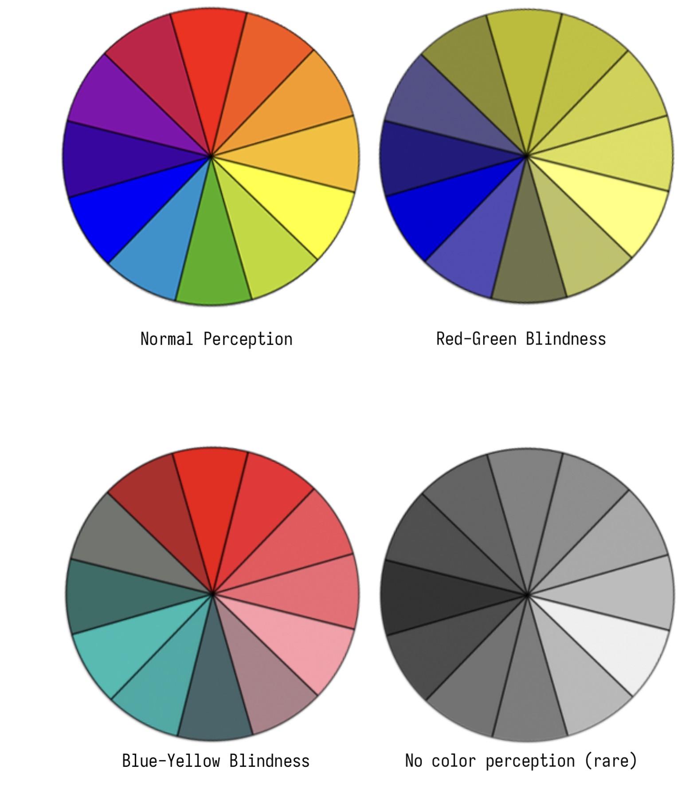

import ColorBlindness from "../../components/ColorBlindness";

# Accessibility

Accessibility ensures that people with disabilities can perceive, understand, navigate, interact with, and contribute to the web.
Most of the websites in the internet is not built with accessibility in mind. Continuum Components were built accessibility in mind.
We follow the [WAI-ARIA Authoring Practices 1.1](https://www.w3.org/TR/wai-aria-practices-1.1/) guidelines to ensure that our components are accessible to everyone.

> It is important to remember that using CDS alone does not make your site accessible

## Visual

Visual perception is the main way we interact with the web. It is important to make sure that the content is accessible to everyone.
This is not only a problem for people with disabilities, but also for people with low-end devices, slow internet connection, or even people who are in a hurry and want to find the information they want as soon as possible.

The World Health Organization estimates that

> 285 million people are estimated to be visually impaired worldwide: 39 million are blind and 246 million have low vision[^1].
> that is, 14% are blind and 86% have low vision

[^1]: https://www.who.int/en/news-room/fact-sheets/detail/blindness-and-visual-impairment

### Color-blind users

{/* https://pick-palette.netlify.app/ */}

#### Monochromacy

Monochromacy is a condition where a person can’t see colors – only black, white, and shades of grey.
Monochromacy is a broad term covering two conditions:

- **Rod monochromacy (Achromatopsia)**, where someone can’t see color because of missing or inert retinal cones, is very rare and often accompanied by light sensitivity or near/far-sightedness
- **Cone monochromacy**, where people can’t see color but have generally normal vision otherwise.

#### Tritanopia

Tritanopia is a form of color blindness where a person can’t tell the difference between blue and yellow. People with tritanopia can still perceive red and green hues.

#### Deuteranopia

People with deuteranopia can’t distinguish green colors, making it one subtype of what’s commonly called “red-green colorblindness”. Deuteranope can exhibit a nearly complete blindness to green or a lack of sensitivity to green hues (known as deuteranomaly). It’s estimated that about 1% of males and 0.1% of females have deuteranopia.

#### Protanopia

Protanopia is a condition where people can’t distinguish red hues, and it’s the other subtype of red-green colorblindness. About 0.02% of females and 1.01% of males have some form of protanopia.

{/*  */}

<ColorBlindness />

> First, do not use accessibility overlays[^2]. Accessibility overlays are automated tools that claim to find and fix accessibility issues on your website.
> They’re really more of a quick band-aid that covers over the problems rather than correcting any issues in the source code of your site.
> At best, accessibility overlays present legal risks for your business and website.
> At worst, they actually make it harder for people with disabilities to use your site by adding new barriers like navigation and incompatibility with assistive technologies.

[^2]: https://www.siteimprove.com/glossary/accessibility-overlays/

### Low-vision users

Low vision is a pervasive condition in which people have difficulty seeing even with corrective lenses.
People with low vision frequently use mainstream computing devices, however how they use their devices to access information and whether digital low vision accessibility tools provide adequate support remains understudied.

### Blind users

Blindness is a condition where a person can’t see at all. Blindness can be caused by a number of conditions, including retinal damage, cataracts, glaucoma, and more.

### Color Contrast

Color contrast between the foreground and the background is important for the text and foreground to be visible and readable.

According to the standards provided by [W3C](https://www.w3.org/TR/UNDERSTANDING-WCAG20/visual-audio-contrast-contrast.html),

- **Normal text** (less than 18pt or 14pt bold) should have a contrast ratio of at least 4.5:1
- **Large text** (18pt or 14pt bold) should have a contrast ratio of at least 3:1

## Keyboard

Web is not only for mouse users. Keyboard shortcuts enable keyboard users to invoke commands using the keyboard that would otherwise require accessing a menu or using touch or a mouse.
This ensures the inclusiveness of the web for various users who are not able to use a mouse.Keyboard shortcuts for navigation and focus management are essential for keyboard users to access the web.

## ARIA attributes

ARIA attributes are used to provide additional information about the elements to the screen readers. They are used to provide information about the role, state and properties of the elements.

| Attribute                 | Description                                                               |
| ------------------------- | ------------------------------------------------------------------------- |
| `aria-label{:html}`       | Used to provide a label for an element that is not visible on the screen. |
| `aria-labelledby{:html}`  | Used to provide a label for an element that is visible on the screen.     |
| `aria-describedby{:html}` | Used to provide a description for an element.                             |
| `aria-hidden{:html}`      | Used to hide an element from the screen readers.                          |
| `aria-live{:html}`        | Used to inform the screen readers about the changes in the content.       |

## Alt texts

Alt texts are used to describe the web content for screen readers or to users when visual contents are turned off. It is important to provide alt texts for images, icons, and other visual elements.

It is advisable to avoid using alt texts for visual elements that are purely for aesthetic purposes such as abstract art as they are not important for screen readers.Such elements can be ignored by screen readers using `aria-hidden{:html}` attribute.

If we want the alternate text to be something complex such as a another markup, we can use `aria-labelledby{:html}` attribute to reference the id of the element that contains the alternate text.
e.g.

```html
<label for="password">Password:</label>
<input aria-describedby="passwordrules" id="password" type="password" />
<div role="tooltip" id="passwordrules">
  <p>Password Rules:</p>
  <ul>
    <li>Minimum of 8 characters</li>
    <li>
      Include at least one lowercase letter, one uppercase letter, one number
      and one special character
    </li>
    <li>Unique to this website</li>
  </ul>
</div>
```

{/* Visual elements for aesthetic purposes and does not contains information should be avoided having alt texts . */}
{/* Visual elements for aesthetic purposes such as abstract art, scribbles must be ignored by screen readers using `aria-hidden` attribute. */}

### Images

Providing alt texts for images is important for screen readers to understand the content of the image.Additionally when the image is not loaded or turned off, alternate texts are displayed in their place and they provide more context for the users to understand the image better.Also including alt texts improves the SEO(search engine optimization) and makes the website more discoverable.

For more information about writing alt texts for images, refer to the following links:

- https://ibeccreative.com/how-to-master-the-art-of-writing-alt-text/
- https://dev.to/masakudamatsu/mastering-the-art-of-alt-text-for-images-2900
- https://boldist.co/usability/writing-alt-text-for-accessibility/

### Icons

Stand alone icons without any text that performs an action should have a `role{:html}` attribute with a value of `button{:html}` or `link{:html}` to indicate that they are interactive elements.They should also have an alt text to describe their purpose for those who can't see them.

{/* - aria-hidden

- aria-label */}

### Links

For links, the `title{:html}` attribute should be descriptive, clear and concise as they are used as tooltips for links. They should inform the users about the purpose of the link. Also, the `href{:html}` attribute is required to be present properly for redirects.

{/* - title - for tooltips must be descriptive

- proper a tag with href */}

### Tooltips

Tooltips are displayed around an element on hovering or focussing. They are used to provide additional information about the element like the abbreviations or acronyms. The tooltip should be descriptive enough and should not be too long.

#### Abbreviations

When including an abbreviation or acronym, provide a full expansion of the term in plain text on first use, along with the `<abbr>{:html}` to mark up the abbreviation. This informs the user what the abbreviation or acronym means.

The optional title attribute can provide an expansion for the abbreviation or acronym when a full expansion is not present. This provides a hint to user agents on how to announce/display the content while informing all users what the abbreviation means. If present, title must contain this full description and nothing else.

{/* https://primer.style/design/guides/accessibility/tools */}

---
